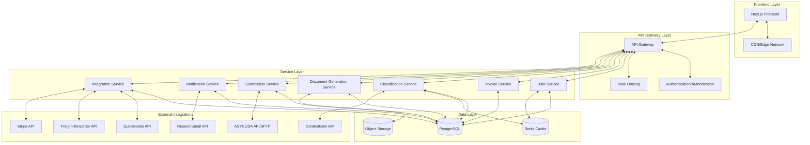
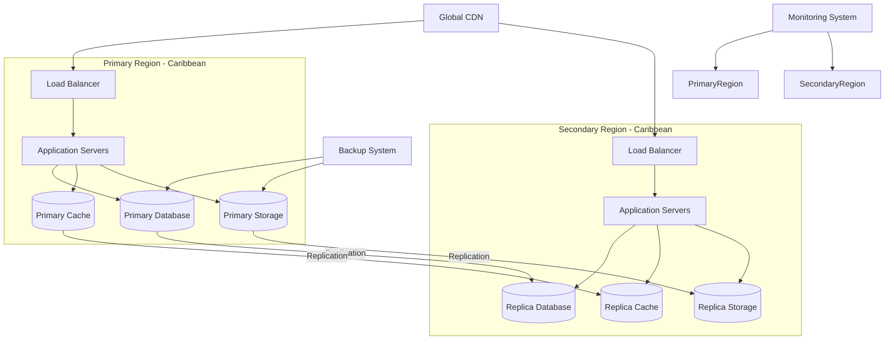
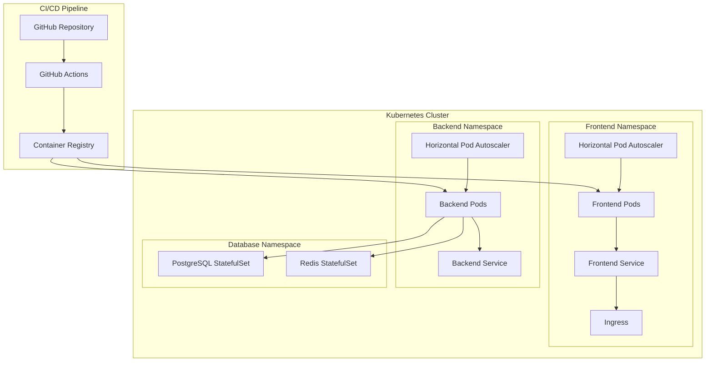
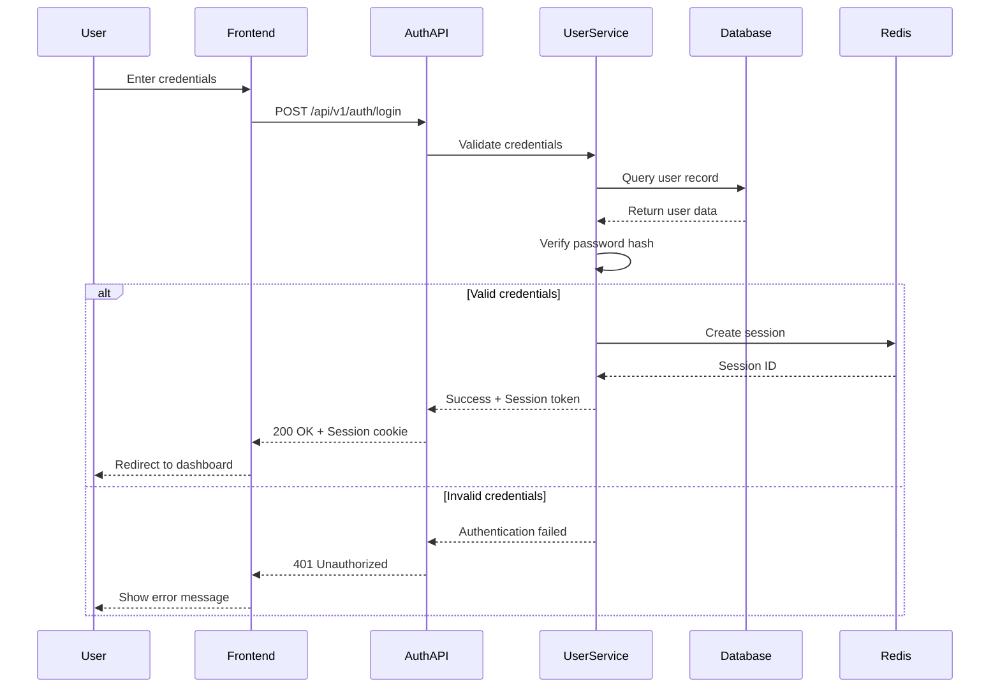
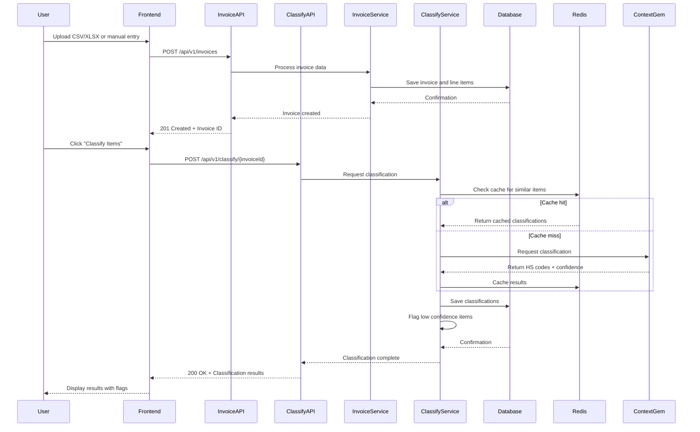
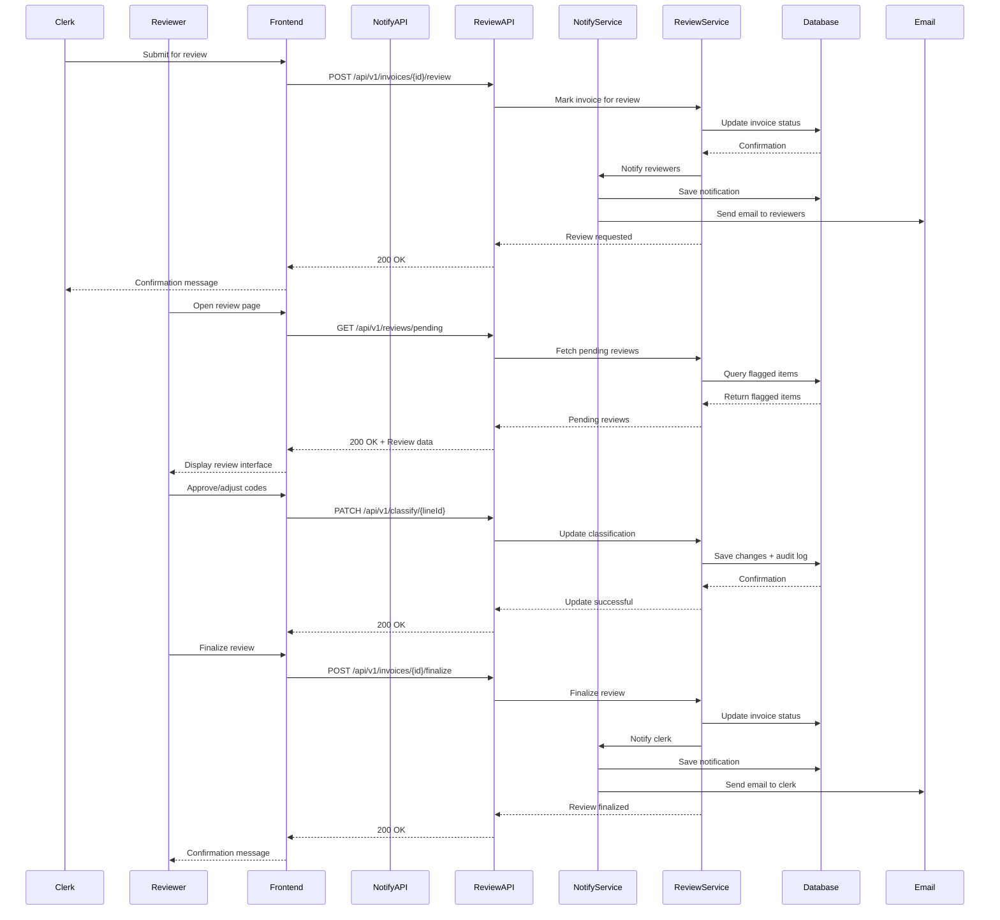
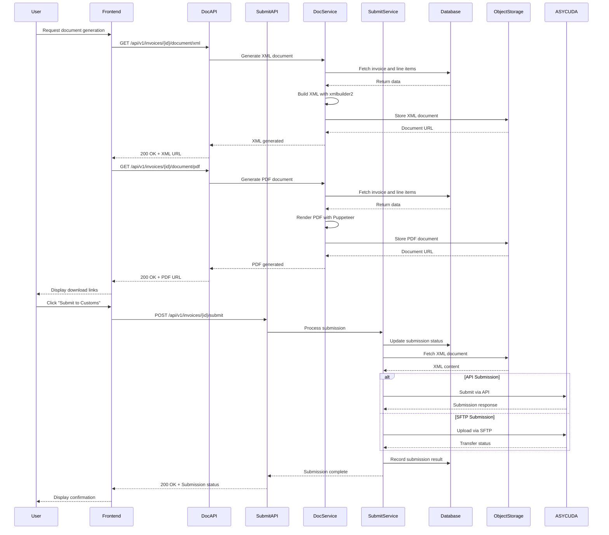

# Automated Customs Documentation Platform - Architecture Plan

## 1. Overall System Architecture

### 1.1 High-Level Architecture Overview

The Automated Customs Documentation Platform will follow a modern, cloud-native architecture designed for scalability, resilience, and security. The system will be built using a microservices-oriented approach with clear separation of concerns.



### 1.2 Infrastructure Architecture

To meet the high availability and disaster recovery requirements (99.99% uptime, RTO 1 hour, RPO 15 minutes), we'll implement a multi-region, active-passive architecture with automated failover capabilities.



### 1.3 Deployment Architecture

The deployment architecture will leverage containerization and orchestration to enable horizontal scaling and efficient resource utilization.



## 2. Component Diagram

The following component diagram shows the relationships between different parts of the system:

```mermaid
component
    %% Frontend Components
    component "Next.js Frontend" as Frontend {
        component "Authentication Module" as AuthModule
        component "Invoice Grid (AG Grid)" as Grid
        component "Document Viewer" as DocViewer
        component "Notification Center" as NotifCenter
        component "Admin Console" as AdminConsole
    }
    
    %% Backend Components
    component "API Layer" as API {
        component "Auth Controller" as AuthController
        component "Invoice Controller" as InvoiceController
        component "Classification Controller" as ClassifyController
        component "Document Controller" as DocController
        component "Submission Controller" as SubmitController
        component "Integration Controller" as IntegController
    }
    
    component "Service Layer" as Services {
        component "User Service" as UserService
        component "Invoice Service" as InvoiceService
        component "Classification Service" as ClassifyService
        component "Document Generation Service" as DocGenService
        component "Submission Service" as SubmitService
        component "Notification Service" as NotifyService
        component "Integration Service" as IntegService
    }
    
    component "Data Access Layer" as DAL {
        component "User Repository" as UserRepo
        component "Invoice Repository" as InvoiceRepo
        component "Classification Repository" as ClassifyRepo
        component "Submission Repository" as SubmitRepo
        component "Audit Repository" as AuditRepo
    }
    
    %% External Systems
    component "External APIs" as ExternalAPIs {
        component "ContextGem API" as ContextGemAPI
        component "ASYCUDA API/SFTP" as ASYCUDAAPI
        component "QuickBooks API" as QuickBooksAPI
        component "Freight-forwarder API" as FreightAPI
        component "Stripe API" as StripeAPI
        component "Resend API" as ResendAPI
    }
    
    %% Data Stores
    database "PostgreSQL" as PostgreSQL {
        component "Users Table" as UsersTable
        component "Roles Table" as RolesTable
        component "Invoices Table" as InvoicesTable
        component "Invoice Lines Table" as InvoiceLinesTable
        component "Classifications Table" as ClassificationsTable
        component "Submissions Table" as SubmissionsTable
        component "Audit Logs Table" as AuditLogsTable
    }
    
    database "Redis" as Redis {
        component "Session Store" as SessionStore
        component "Classification Cache" as ClassifyCache
        component "Rate Limiting" as RateLimit
    }
    
    storage "Object Storage" as ObjectStorage {
        component "Generated Documents" as Documents
        component "Backup Data" as Backups
    }
    
    %% Relationships
    AuthModule --> AuthController
    Grid --> InvoiceController
    Grid --> ClassifyController
    DocViewer --> DocController
    NotifCenter --> NotifyService
    AdminConsole --> AuthController
    
    AuthController --> UserService
    InvoiceController --> InvoiceService
    ClassifyController --> ClassifyService
    DocController --> DocGenService
    SubmitController --> SubmitService
    IntegController --> IntegService
    
    UserService --> UserRepo
    InvoiceService --> InvoiceRepo
    ClassifyService --> ClassifyRepo
    SubmitService --> SubmitRepo
    
    UserRepo --> UsersTable
    UserRepo --> RolesTable
    InvoiceRepo --> InvoicesTable
    InvoiceRepo --> InvoiceLinesTable
    ClassifyRepo --> ClassificationsTable
    SubmitRepo --> SubmissionsTable
    
    ClassifyService --> ContextGemAPI
    SubmitService --> ASYCUDAAPI
    IntegService --> QuickBooksAPI
    IntegService --> FreightAPI
    IntegService --> StripeAPI
    NotifyService --> ResendAPI
    
    UserService --> SessionStore
    ClassifyService --> ClassifyCache
    API --> RateLimit
    
    DocGenService --> Documents
```

## 3. Data Flow for Key Processes

### 3.1 User Authentication Flow



### 3.2 Invoice Entry and Classification Flow



### 3.3 Review and Approval Flow



### 3.4 Document Generation and Submission Flow



## 4. Technical Challenges and Solutions

### 4.1 Scalability Challenges

| Challenge | Solution |
|-----------|----------|
| Handling 1000+ concurrent users | - Implement horizontal scaling with Kubernetes<br>- Use stateless services for easy scaling<br>- Implement database connection pooling<br>- Optimize database queries with proper indexing |
| Large dataset processing | - Implement pagination and virtual scrolling in AG Grid<br>- Process large CSV/XLSX files in chunks on the server<br>- Use worker threads for CPU-intensive operations<br>- Implement background processing for classification jobs |
| Classification API rate limits | - Implement Redis-based caching of classification results<br>- Use bulk classification requests where possible<br>- Implement retry mechanisms with exponential backoff<br>- Maintain a local copy of common classifications |

### 4.2 High Availability and Disaster Recovery Challenges

| Challenge | Solution |
|-----------|----------|
| Achieving 99.99% uptime | - Deploy across multiple availability zones<br>- Implement automated health checks and failover<br>- Use managed database services with high availability<br>- Implement circuit breakers for external dependencies |
| Meeting 1-hour RTO | - Maintain warm standby environment in secondary region<br>- Automate deployment and recovery procedures<br>- Implement comprehensive monitoring and alerting<br>- Regular disaster recovery testing |
| Meeting 15-minute RPO | - Implement continuous database replication<br>- Use write-ahead logging for transaction durability<br>- Implement point-in-time recovery capabilities<br>- Regular automated backups with quick restore testing |

### 4.3 Security and Compliance Challenges

| Challenge | Solution |
|-----------|----------|
| Jamaica Data Protection Act compliance | - Store all data in Caribbean region data centers<br>- Implement data encryption at rest and in transit<br>- Maintain comprehensive audit logs<br>- Implement data access controls based on roles |
| Secure customs data handling | - Implement end-to-end encryption for sensitive data<br>- Use secure channels (TLS, SFTP) for data transmission<br>- Implement data masking for PII in logs and reports<br>- Regular security audits and penetration testing |
| Authentication and authorization | - Implement MFA for all user roles<br>- Use role-based access control (RBAC)<br>- Implement session management with secure cookies<br>- Regular security training for all users |

### 4.4 Integration Challenges

| Challenge | Solution |
|-----------|----------|
| ASYCUDA API reliability | - Implement fallback to SFTP for submission<br>- Maintain detailed logs of all submission attempts<br>- Implement retry logic with notification on failure<br>- Regular testing of both submission methods |
| ContextGem API performance | - Implement caching of classification results<br>- Develop a fallback classification mechanism<br>- Monitor API performance and adjust batch sizes<br>- Maintain a local database of common classifications |
| QuickBooks and freight-forwarder integration | - Implement webhook handlers for real-time updates<br>- Use polling as a fallback for webhook failures<br>- Implement data validation before synchronization<br>- Maintain detailed logs of all integration activities |

## 5. Technology Recommendations

### 5.1 Frontend Technologies

| Technology | Version | Justification |
|------------|---------|---------------|
| React | 18.2.0 | Latest stable version with concurrent rendering features for improved UI responsiveness |
| Next.js | 14.0.0 | Latest version with improved performance, built-in optimizations, and server components |
| AG Grid | 29.0.0 | Enterprise-grade grid component with virtual scrolling, filtering, and Excel-like features |
| Tailwind CSS | 3.3.0 | Utility-first CSS framework for rapid UI development with minimal CSS overhead |
| NextAuth.js | 4.22.0 | Authentication library with built-in support for multiple providers and MFA |

### 5.2 Backend Technologies

| Technology | Version | Justification |
|------------|---------|---------------|
| Node.js | 20.2.1 | LTS version with improved performance and modern JavaScript features |
| Express | 4.18.2 | Mature, well-supported web framework for Node.js with extensive middleware ecosystem |
| PostgreSQL | 15.0 | Enterprise-grade relational database with advanced features for high availability |
| Redis | 7.0 | In-memory data store for caching, session management, and rate limiting |
| xmlbuilder2 | 3.0.2 | Modern XML builder library for generating ASYCUDA-compliant documents |
| Puppeteer | 19.7.1 | Headless Chrome API for generating PDF documents from XML/HTML |

### 5.3 Infrastructure and DevOps

| Technology | Version | Justification |
|------------|---------|---------------|
| Kubernetes | 1.27 | Container orchestration platform for managing scalable, resilient applications |
| Docker | 24.0 | Containerization platform for consistent deployment across environments |
| GitHub Actions | N/A | CI/CD platform integrated with GitHub for automated testing and deployment |
| AWS/Azure/GCP | N/A | Cloud provider with data centers in the Caribbean region for compliance |
| Prometheus & Grafana | N/A | Monitoring and alerting stack for observability and performance tracking |
| Vault | N/A | Secrets management for secure handling of API keys and credentials |

### 5.4 Security and Compliance

| Technology | Version | Justification |
|------------|---------|---------------|
| OWASP ZAP | N/A | Security testing tool for identifying vulnerabilities in web applications |
| SonarQube | N/A | Code quality and security scanner for identifying code vulnerabilities |
| Snyk | N/A | Dependency vulnerability scanner for identifying security issues in dependencies |
| AWS KMS/Azure Key Vault | N/A | Managed key management service for encryption key management |
| Cloudflare | N/A | CDN and security service for DDoS protection and WAF capabilities |

## 6. Conclusion

The proposed architecture for the Automated Customs Documentation Platform is designed to meet the current requirements while providing a solid foundation for future growth. The system is designed to be:

1. **Scalable**: Able to handle growth to 1000+ concurrent users through horizontal scaling and efficient resource utilization.
2. **Resilient**: Achieving 99.99% uptime with multi-region deployment, automated failover, and comprehensive monitoring.
3. **Secure**: Implementing industry best practices for authentication, authorization, encryption, and audit logging.
4. **Compliant**: Meeting Jamaica's Data Protection Act requirements with data residency in the Caribbean region and comprehensive data protection measures.
5. **Performant**: Meeting or exceeding the performance requirements for grid loading, classification, and document generation.

The architecture leverages modern cloud-native technologies and practices to deliver a robust, maintainable, and cost-effective solution that will provide significant value to importers by automating customs documentation processes.